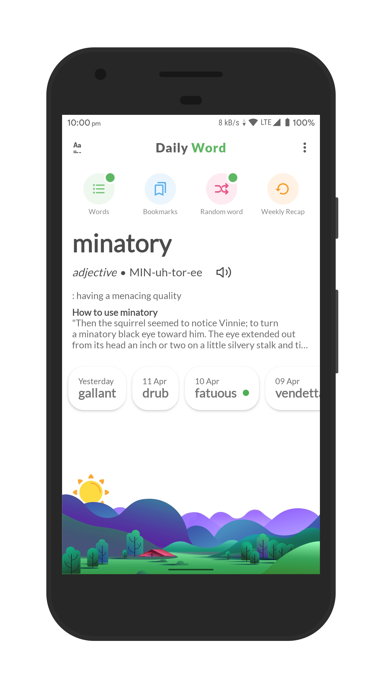
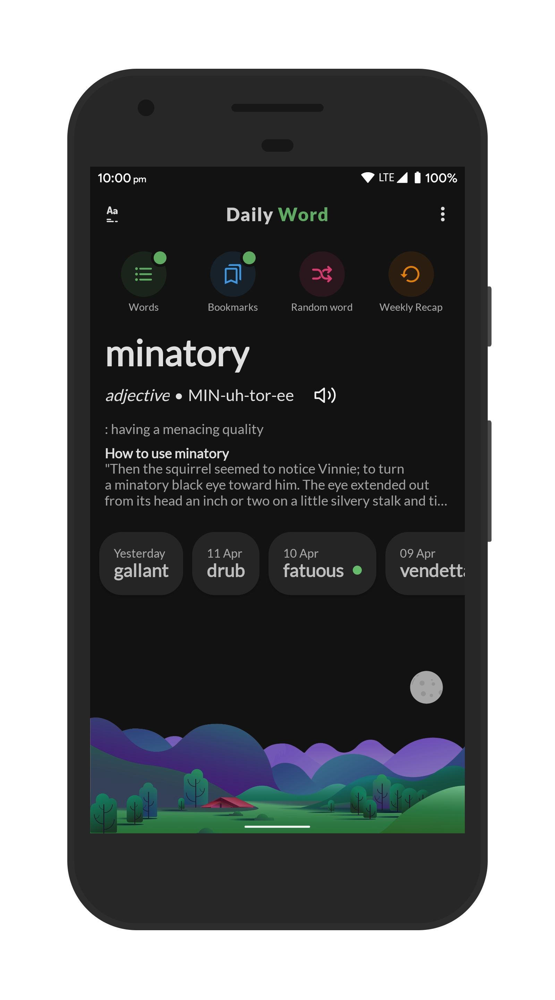
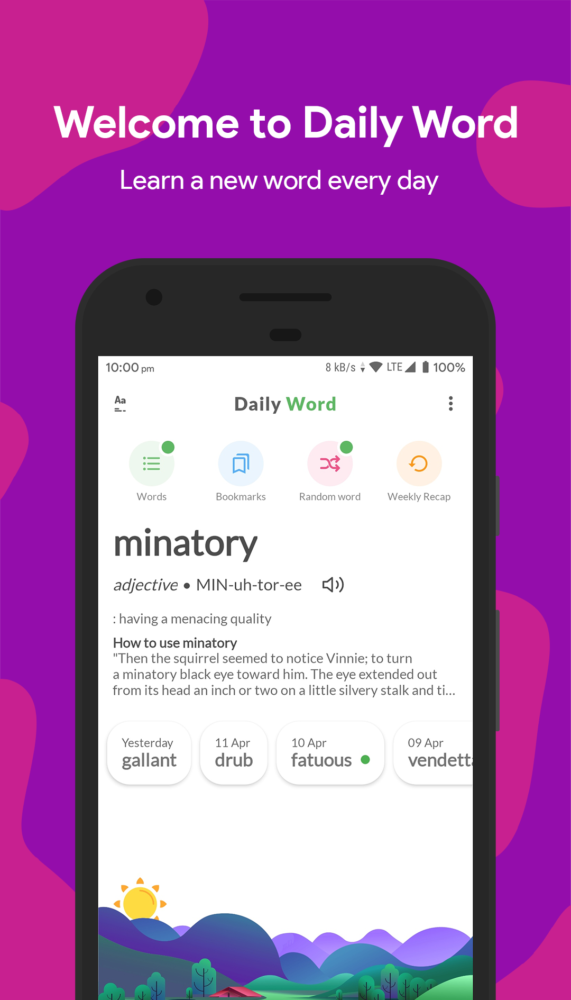
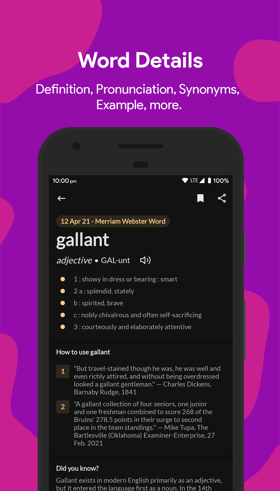
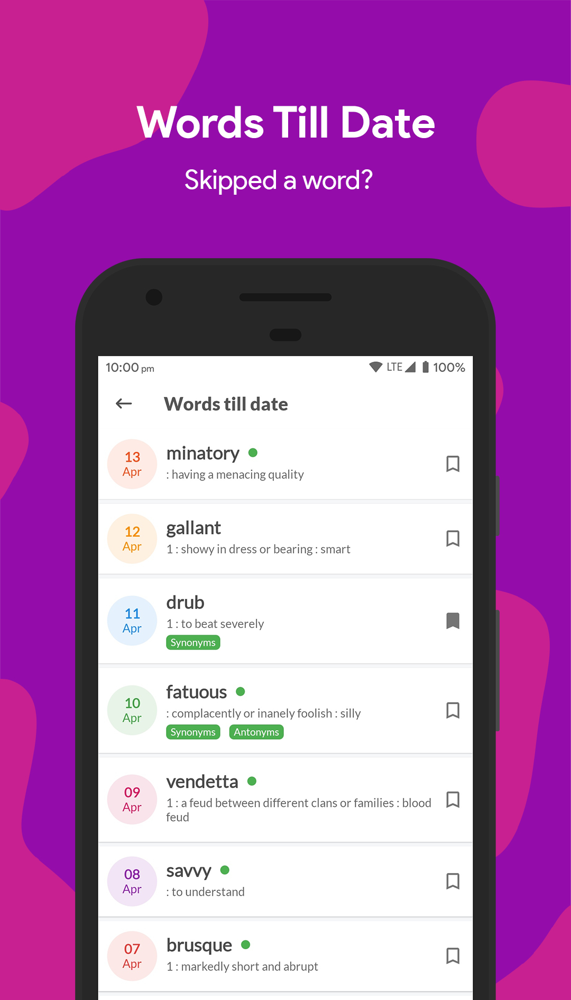
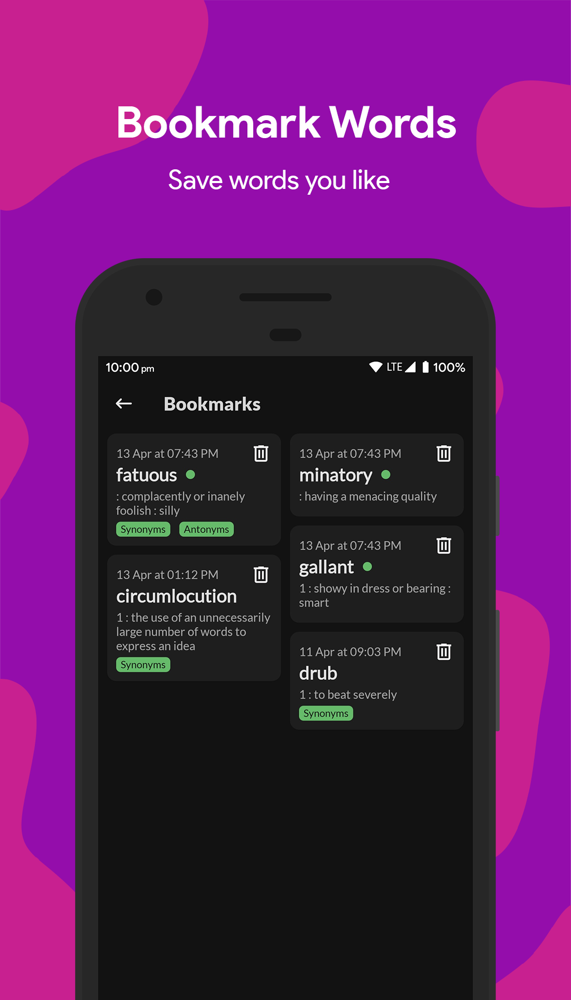
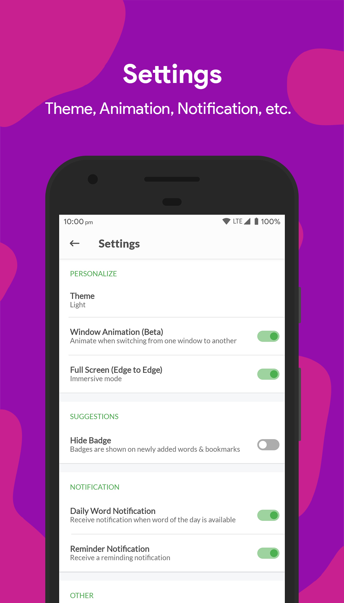

# Daily Word

### 📱 Screenshots
#### App Theme
|  |  | 
|:---:|:---:|
|Light Mode| Dark Mode|
#### App Features
|  |  |  |  | 
|:---:|:---:|:---:|:---:|:---:|
|Home Screen| Word Details| Word Till Date| Bookmark Words| Settings|
### 📦 Features
    • Definitions and example sentences for every word
    • Pronunciation
    • Notification when new word is available
    • Dark mode
    • Edge to Edge functionality
    • List of all words till date
    • Bookmark words
    • Beautiful widgets (2x1, 3x2 and 5x3)
    • Badge indication for each word
    • Recap your word knowledge every Sunday
    • Read random words just a click away!"
